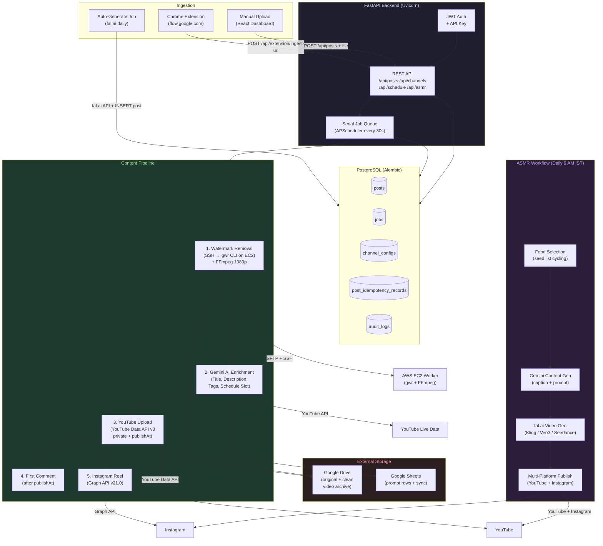

# YouTube Auto Pipeline

A self-hosted, fully automated content pipeline that takes AI-generated videos from creation to published — handling watermark removal, AI metadata enrichment, YouTube scheduling, Google Drive archiving, and Instagram Reels publishing with zero manual intervention after setup.

---

## Overview

YouTube Auto Pipeline is an end-to-end content automation system built to replace manual workflows and commercial tools like n8n. It ingests video files (either uploaded directly or captured via a Chrome extension from Google Flow AI), removes AI watermarks via a remote SSH worker running the `gwr` (Gemini Watermark Remover) CLI, uses Gemini AI to generate SEO-optimized titles, descriptions, and scheduling slots based on live YouTube channel data and Google Sheets prompts, uploads the video to YouTube as a private scheduled post, syncs metadata back to Google Sheets, posts a pinned first comment after the video goes public, and simultaneously publishes the cleaned video as an Instagram Reel.

A companion **ASMR content workflow** runs daily at 9 AM IST and generates entirely new short-form food ASMR videos from scratch using fal.ai's cloud AI video generation (Kling v3, Veo 3, or Seedance), then pushes them through the same pipeline without any laptop or browser involvement.

The system is deployable as a single Docker container (or to [Render.com](https://render.com)) and ships with a React dashboard for real-time pipeline monitoring, schedule management, channel configuration, and job introspection.

---

## Key Features

- **Watermark Removal** — SFTP uploads the original video to a remote EC2 worker, runs `pnpm exec gwr remove` via SSH, then downloads the cleaned MP4. A subsequent FFmpeg pass enforces 1080p Full HD quality (CRF 17, H.264 High, 30 Mbps target bitrate).
- **AI Content Enrichment** — Gemini Flash queries live YouTube channel statistics, the last 20 video titles, and a Google Sheet row to produce an SEO-optimized title, multi-layered description, 15–20 keyword tags, a pinned first comment, and a scheduled publish time aligned to viral peak slots (12:30 PM or 6:30 PM IST).
- **YouTube Scheduling** — Videos are uploaded via the YouTube Data API v3 as `private` with a `publishAt` timestamp set to the Gemini-chosen slot. The serial queue handles upload fan-out without blocking other pipeline steps.
- **Google Sheets Sync** — After each upload, the corresponding sheet row is updated with the scheduled date, YouTube video ID, and enriched title.
- **Google Drive Archive** — Both the original and cleaned video files are archived to a Google Drive folder using service-account credentials, ensuring videos survive ephemeral container restarts on Render.
- **Instagram Reels Publishing** — Publishes the cleaned video to Instagram via the Graph API v21.0. Containers are pre-created while the video file is on disk and published at the scheduled time.
- **fal.ai Auto-Generation** — A daily job reads Google Sheet rows with video prompts, calls fal.ai (Kling v3, Veo 3, or Seedance) to generate 9:16 short-form videos, downloads them, and inserts them as new posts for the pipeline to process.
- **Chrome Extension** — A Manifest v3 extension injects into Google Flow AI (flow.google.com), captures generated video download URLs, and sends them to the pipeline API. The popup surfaces active sheet rows and provides one-click video ingestion.
- **ASMR Content Workflow** — A separate, fully automated daily workflow selects an unused food item from a seed list, generates AI content (caption, description, prompt) via Gemini, produces a video via fal.ai, and publishes to both YouTube and Instagram.
- **Serial Job Queue** — All pipeline steps run through a single APScheduler-driven serial queue (every 30 s) with a global threading lock, ensuring only one post advances at a time and preventing resource starvation.
- **Reliability Infrastructure** — Circuit breaker (auto-pauses queue on DLQ overflow), exponential-backoff retries (up to 5 attempts per post), idempotency records (prevents duplicate YouTube/Instagram publishes across crashes), startup recovery (resets posts stuck in `cleaning` or `scheduled` states), and distributed lock support for multi-worker deployments.
- **Security** — JWT authentication with stateful refresh token rotation (SHA-256 hashed, server-side revocable), Fernet AES-128 at-rest encryption for OAuth tokens in the database, per-IP sliding-window rate limiting, SSRF protection on URL ingestion, and an append-only `AuditLog` for all security-relevant events.
- **React Dashboard** — Live pipeline dashboard with post status tracking, schedule calendar, channel stats, ASMR workflow management, job execution history, and a settings panel for toggling watermark cleaning on/off.

---

## Architecture



---

## Post Lifecycle

Every post progresses through a strict, audited state machine:

```
queued → cleaning → cleaned → scheduled → uploaded → commented
                                                    ↘ instagram published
                     ↕ (watermark toggle OFF)
                  cleaned (skipped directly)

Any step → failed (with retry backoff up to max_retries=5)
```

| Status | What happens |
|---|---|
| `queued` | Post accepted, waiting for SSH watermark worker |
| `cleaning` | gwr running on EC2; post locked in background thread |
| `cleaned` | Clean MP4 on disk; ready for Gemini enrichment |
| `scheduled` | Gemini ran; YouTube upload submitted (private, future publishAt) |
| `uploaded` | YouTube video ID confirmed; waiting for comment window |
| `commented` | Pinned first comment posted; pipeline complete |
| `failed` | Error recorded; retry backoff scheduled |

---

## Tech Stack

| Layer | Technology |
|---|---|
| **API Framework** | FastAPI 0.115 + Uvicorn |
| **Database** | PostgreSQL 15 via SQLAlchemy 2.0 + Alembic migrations |
| **Scheduler** | APScheduler 3.10 (BackgroundScheduler, IST timezone) |
| **AI / LLM** | Google Gemini 2.5 Flash (`google-generativeai`) |
| **AI Video Gen** | fal.ai REST API (Kling v3, Veo 3, Seedance) |
| **YouTube** | YouTube Data API v3 (`google-api-python-client`) |
| **Instagram** | Instagram Graph API v21.0 (via `httpx`) |
| **Google Sheets** | gspread 6 + Service Account JSON |
| **Google Drive** | Drive API v3 + OAuth2 user credentials |
| **SSH / SFTP** | Paramiko 3.5 (watermark worker connection) |
| **Auth** | JWT (python-jose) + bcrypt + Fernet token encryption |
| **Frontend** | React 18 + Vite 8 + TanStack Query v5 + Recharts |
| **Extension** | Chrome Manifest v3 (content script + service worker + popup) |
| **Deployment** | Docker (multi-stage), docker-compose, Render.com `render.yaml` |

---

## API Reference

### Authentication

All `/api/*` routes (except health probes and `/api/auth/*`) require a Bearer token — either the static `API_KEY` or a valid JWT access token.

| Endpoint | Method | Description |
|---|---|---|
| `/api/auth/login` | POST | Username + password → `{access_token, refresh_token}` |
| `/api/auth/refresh` | POST | Rotate refresh token → new token pair |
| `/api/auth/me` | GET | Verify access token, return username |
| `/api/auth/logout` | POST | Revoke current refresh token (server-side) |
| `/api/auth/logout-all` | POST | Revoke all sessions for this user |
| `/api/auth/sessions` | GET | List active sessions with device info |

### Posts

| Endpoint | Method | Description |
|---|---|---|
| `/api/posts` | GET | List posts with status, pagination, and filtering |
| `/api/posts` | POST | Upload video file + metadata → create queued post |
| `/api/posts/{id}` | GET | Get post detail with full workflow event history |
| `/api/posts/{id}` | DELETE | Delete post and associated files |
| `/api/posts/{id}/retry` | POST | Re-queue a failed post |
| `/api/posts/{id}/cancel` | POST | Cancel active watermark job (kills remote gwr process) |

### Channels

| Endpoint | Method | Description |
|---|---|---|
| `/api/channels` | GET | List all channels with live YouTube stats |
| `/api/channels` | POST | Create a new channel configuration |
| `/api/channels/{key}` | PATCH | Update channel credentials or Sheets config |
| `/api/channels/{key}/oauth/start` | GET | Begin Google OAuth flow for a channel |
| `/api/channels/oauth/callback` | GET | Handle OAuth redirect; stores refresh token |
| `/api/channels/{key}/instagram/test` | POST | Validate Instagram Graph API credentials |

### Schedule

| Endpoint | Method | Description |
|---|---|---|
| `/api/schedule` | GET | Calendar view of scheduled slots (DB + live YouTube) |
| `/api/schedule/reschedule` | POST | Move a post to a new publish time |
| `/api/schedule/youtube` | GET | Live scheduled videos from YouTube API |

### Jobs & Metrics

| Endpoint | Method | Description |
|---|---|---|
| `/api/jobs` | GET | Job execution history with status and duration |
| `/api/jobs/circuit-breaker/reset` | POST | Manually reset a tripped circuit breaker |
| `/api/metrics` | GET | Pipeline queue depths, job p50/p95 latencies, uptime |
| `/api/health/live` | GET | Liveness probe (always 200 if process alive) |
| `/api/health/ready` | GET | Readiness probe (checks DB connectivity) |

### ASMR Workflow

| Endpoint | Method | Description |
|---|---|---|
| `/api/asmr/trigger` | POST | Manually trigger ASMR workflow run |
| `/api/asmr/runs` | GET | List workflow run history |
| `/api/asmr/runs/{id}` | GET | Single run detail with content jobs |
| `/api/asmr/food` | GET | Food item seed list with cycle status |
| `/api/asmr/food` | POST | Add food items to the seed list |

### Auto-Generate

| Endpoint | Method | Description |
|---|---|---|
| `/api/auto/status` | GET | fal.ai config status, next run time, last run result |
| `/api/auto/trigger` | POST | Manually trigger cloud video generation now |

### Chrome Extension

| Endpoint | Method | Description |
|---|---|---|
| `/api/extension/channels` | GET | Active channels list for extension popup |
| `/api/extension/sheet-rows` | GET | Unscheduled Google Sheet rows for a channel |
| `/api/extension/ingest-url` | POST | Ingest a video URL (SSRF-validated) → queued post |
| `/api/extension/upload` | POST | Upload video binary from extension |

---

## Watermark Removal Pipeline

The watermark removal service (`services/watermark.py`) mirrors the original n8n workflow exactly:

1. **SSH Connect** — Opens a Paramiko connection to the configured EC2 worker. Supports pinned host key (`WORKER_SSH_KNOWN_HOST_KEY`), key-file auth, in-memory key content, and password fallback.
2. **SFTP Upload** — Transfers `input-{job_id}.mp4` to the worker's temp directory.
3. **Run gwr** — Executes `pnpm exec gwr remove input.mp4 --output clean.mp4 --video-bitrate-mbps 30 --json` with a 30-minute timeout. Parses JSON stdout to confirm `{"success": true}`. Exit code 4 (low watermark confidence) uses the original video as-is.
4. **FFmpeg 1080p Pass** — Enforces `scale=1080:-2`, H.264 High profile, CRF 17, 25 Mbps target bitrate, AAC 384k audio, BT.709 color space.
5. **SFTP Download** — Transfers the enhanced clean video to the local `processed/` directory.
6. **Remote Cleanup** — Deletes all temp files from the EC2 worker.
7. **DB Update** — Sets `post.clean_video_path`, advances status to `cleaned`.

Cancellation is fully supported: the queue can issue `cancel_cleaning_job(post_id)` at any time, which SSH-kills the remote `gwr`/`node`/`chromium` processes and deletes all temp files.

---

## Gemini Enrichment

The enrichment service (`services/enrichment.py`) builds a multi-section prompt from:
- **Live YouTube channel data** — subscriber count, recent 20 video titles (to enforce title diversity)
- **Google Sheet row** — the specific prompt row targeted for this post
- **Current IST time** — to allow Gemini to calculate a valid future slot

Gemini is instructed to return strict JSON with `{id, title, description, tags, firstComment, date}`. Seven distinct title hook styles are enforced to prevent repetition. The `date` field is constrained to either 12:30 PM or 6:30 PM IST with at least a 5-hour gap from recent videos.

A rule-based fallback (`_enrichment_rules.py`) applies if `GEMINI_API_KEY` is not set.

---

## Reliability Design

| Mechanism | Implementation |
|---|---|
| **Idempotency** | `PostIdempotencyRecord` keyed by `youtube:post:{id}:publish`, `instagram:post:{id}:publish`, etc. Prevents duplicate publishes after crashes. |
| **Retry Backoff** | `retry_count`, `max_retries=5`, `next_retry_at` persisted in DB. Exponential backoff survives restarts. |
| **Circuit Breaker** | Pauses the serial queue when `dead_letter` job count >= `CIRCUIT_BREAKER_DLQ_THRESHOLD` (default 5). Reset via `POST /api/jobs/circuit-breaker/reset`. |
| **Startup Recovery** | On boot: resets `cleaning` posts to `queued`, clears stale Drive-pending flags, re-queues `scheduled` posts without a video ID that are >15 min stale. |
| **Job Tracking** | Each pipeline step creates a `Job` row with `started_at`, `finished_at`, `duration_ms`, `worker_id`, and full error traceback — separate from `Post.status`. |
| **Workflow Events** | `WorkflowEvent` provides an append-only, immutable audit trail of every step taken on every post. |

---

## Security Model

- **JWT Auth** — Short-lived access tokens (60 min) + long-lived refresh tokens (30 days). Refresh tokens are stored as SHA-256 hashes; the raw token is never persisted. Each use rotates the token.
- **Server-Side Revocation** — `POST /api/auth/logout` and `POST /api/auth/logout-all` invalidate tokens in the database immediately.
- **Token Encryption** — OAuth tokens (YouTube channel refresh tokens) are encrypted at rest in PostgreSQL using Fernet (AES-128-CBC + HMAC-SHA256). Key rotation is supported via `ENCRYPTION_KEY_OLD`.
- **SSRF Protection** — The extension ingest endpoint resolves hostnames and rejects all private/loopback/cloud-metadata IPs (10.x, 127.x, 169.254.x, metadata.google.internal, etc.).
- **Rate Limiting** — Per-IP sliding-window middleware limits request throughput.
- **Security Headers** — `X-Content-Type-Options`, `X-Frame-Options`, `Referrer-Policy`, and `Content-Security-Policy` applied via middleware.
- **Audit Log** — `AuditLog` table records all auth events (login, logout, failures), admin mutations, and configuration changes. Rows are never updated or deleted.
- **Non-Root Container** — Docker runs the app as `appuser` (UID 1001), not root.

---

## Chrome Extension

The **Flow → Pipeline** Manifest v3 extension runs on `flow.google.com` and related Google AI Studio domains.

| Script | Purpose |
|---|---|
| `main_world.js` | Injected into the page's `MAIN` world at `document_start`. Intercepts `fetch` / `XMLHttpRequest` to capture video generation API responses and download URLs. |
| `content.js` | `document_idle` content script. Monitors the DOM for video card elements, extracts video metadata, and relays captures to the background service worker. |
| `auto_generate.js` | Automates video generation sessions — fills prompts, submits forms, monitors generation progress. |
| `background.js` | Service worker. Manages state, queues downloads, coordinates between content scripts and the pipeline API. |
| `popup.js` / `popup.html` | Extension popup UI. Shows active channels, available Google Sheet rows, and allows one-click video submission to the pipeline. |

---

## Deployment

### Docker Compose (Local)

```bash
# Copy and fill in environment variables
cp backend/.env.example backend/.env

# Build and start (PostgreSQL + API + optional worker)
docker compose up --build

# Alembic migrations run automatically via entrypoint.sh
# Access the dashboard at http://localhost:8000
```

The Dockerfile uses a two-stage build: Node 20 Alpine compiles the React frontend, Python 3.11-slim runs the FastAPI backend and serves the compiled static assets.

### Render.com (Cloud)

`render.yaml` configures a Python web service + managed PostgreSQL. A 10 GB persistent disk mounts at `/var/data` for uploaded and processed videos.

```bash
# Deploy by pushing render.yaml to the repo root, then connecting the repo in Render.
# Required environment variables (set in Render dashboard):
#   DATABASE_URL      — auto-injected from managed DB
#   API_KEY           — random 64-char hex
#   JWT_SECRET        — random 64-char hex
#   GEMINI_API_KEY    — Google AI Studio
#   GOOGLE_CLIENT_ID / GOOGLE_CLIENT_SECRET
#   GOOGLE_SHEETS_SERVICE_ACCOUNT_JSON  — full JSON string
#   WORKER_SSH_HOST / WORKER_SSH_KEY_CONTENT / WORKER_SSH_KNOWN_HOST_KEY
#   FAL_API_KEY       — fal.ai (for cloud video generation)
#   TELEGRAM_BOT_TOKEN / TELEGRAM_CHAT_ID — optional notifications
```

### Local Development

```bash
# Backend
cd watermark-pipeline
python -m venv venv && source venv/bin/activate
pip install -r requirements.txt
alembic upgrade head
uvicorn backend.main:app --reload

# Frontend (separate terminal)
cd watermark-pipeline/frontend
npm install
npm run dev
# Dashboard at http://localhost:5173
```

---

## Environment Variables

| Variable | Required | Description |
|---|---|---|
| `DATABASE_URL` | Yes | PostgreSQL connection string |
| `API_KEY` | Yes | Static bearer token for API auth |
| `JWT_SECRET` | Yes | HS256 signing secret for access tokens |
| `GEMINI_API_KEY` | Yes | Google AI Studio API key (content enrichment) |
| `GOOGLE_CLIENT_ID` / `GOOGLE_CLIENT_SECRET` | Yes | OAuth2 credentials for YouTube channel auth |
| `GOOGLE_SHEETS_SERVICE_ACCOUNT_JSON` | Yes | Full service account JSON (inline string or file path) |
| `WORKER_SSH_HOST` | Yes | EC2 hostname for the gwr watermark worker |
| `WORKER_SSH_KEY_CONTENT` | Yes | PEM private key (inline, for Render/Docker) |
| `WORKER_SSH_KNOWN_HOST_KEY` | Yes | Pinned SSH host key (e.g. `ssh-ed25519 AAAA...`) |
| `ENCRYPTION_KEY` | Recommended | Fernet key for at-rest OAuth token encryption |
| `ALLOWED_ORIGINS` | Recommended | Comma-separated CORS origin allowlist |
| `FAL_API_KEY` | Optional | fal.ai key for cloud AI video generation |
| `TELEGRAM_BOT_TOKEN` / `TELEGRAM_CHAT_ID` | Optional | Telegram notifications for ASMR workflow |
| `ADMIN_USERNAME` / `ADMIN_PASSWORD_HASH` | Optional | Single-user dashboard login (bcrypt hash) |
| `FAL_DEFAULT_MODEL` | Optional | `kling` (default), `veo3`, or `seedance` |
| `CIRCUIT_BREAKER_DLQ_THRESHOLD` | Optional | Dead-letter job count before queue pause (default: 5) |
| `LOG_FORMAT` | Optional | `json` (default) or `text` |

---

## Project Structure

```
watermark-pipeline/
├── backend/
│   ├── main.py                   # FastAPI app factory, APScheduler setup, lifespan
│   ├── config.py                 # Pydantic settings (all env vars)
│   ├── models.py                 # SQLAlchemy ORM models
│   ├── schemas.py                # Pydantic request/response schemas
│   ├── routers/                  # FastAPI route handlers
│   │   ├── posts.py              # Video ingest, list, retry, delete
│   │   ├── channels.py           # Channel CRUD + OAuth + YouTube stats
│   │   ├── schedule.py           # Calendar view + reschedule
│   │   ├── extension.py          # Chrome extension ingest API
│   │   ├── asmr.py               # ASMR workflow + food management
│   │   ├── auth.py               # JWT login/refresh/logout/sessions
│   │   ├── jobs.py               # Job history + circuit breaker
│   │   └── metrics.py            # Operational metrics endpoint
│   ├── jobs/                     # APScheduler job implementations
│   │   ├── job_queue.py          # Serial queue orchestrator
│   │   ├── cleaning_job.py       # Watermark removal step
│   │   ├── upload_job.py         # Gemini enrichment + YouTube upload
│   │   ├── comment_job.py        # First comment posting
│   │   ├── instagram_job.py      # Instagram Reel publishing
│   │   └── auto_generate_job.py  # fal.ai cloud video generation
│   ├── services/                 # Business logic + external integrations
│   │   ├── watermark.py          # SSH/SFTP/gwr pipeline
│   │   ├── enrichment.py         # Gemini AI enrichment
│   │   ├── instagram.py          # Instagram Graph API client
│   │   ├── fal_service.py        # fal.ai video generation client
│   │   ├── storage.py            # Google Drive archive
│   │   ├── sheets.py             # Google Sheets read/write
│   │   ├── token_encryption.py   # Fernet at-rest encryption
│   │   ├── idempotency.py        # Duplicate-publish prevention
│   │   ├── circuit_breaker.py    # Queue health + DLQ guard
│   │   └── asmr/                 # ASMR workflow sub-services
│   └── middleware/               # Rate limiting, security headers, request IDs
├── frontend/src/
│   ├── pages/                    # Dashboard, Upload, Schedule, Channels, ASMR, Settings
│   └── components/               # Layout, Sidebar, StatusBadge, RunningJobBanner
├── alembic/                      # Database migration scripts
├── chrome-extension/             # Manifest v3 browser extension
├── Dockerfile                    # Multi-stage build (Node 20 + Python 3.11)
├── docker-compose.yml            # Local development stack
├── render.yaml                   # Render.com deployment blueprint
└── requirements.txt              # Python dependencies
```

---

## License

MIT
